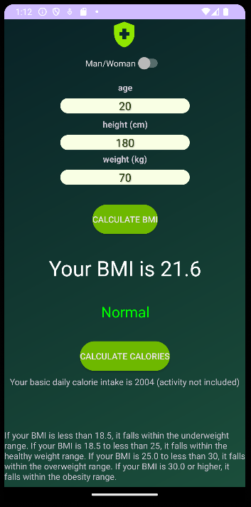

# BMI and Calorie Calculator App

## Overview

Welcome to the BMI and Calorie Calculator App! This mobile application is designed to assist users in calculating their Body Mass Index (BMI) and daily calorie intake based on their gender, height, weight, and age. The app provides a simple and intuitive interface for quick results.

## Features

1. **BMI Calculation:** Enter your height and weight to calculate your BMI instantly. The app categorizes your BMI as underweight, normal, overweight, or obese.

2. **Daily Calorie Intake:** Determine your daily calorie intake based on your gender, weight, height, and age. The app provides a basic estimation for your calorie needs.

3. **Health Recommendations:** Receive additional information about your BMI category, helping you understand whether you are underweight, normal, overweight, or obese.

## Usage

1. Open the app on your mobile device.

2. Enter your height, weight, and age in the designated fields.

3. Toggle the gender switch based on your gender.

4. Tap the "Calculate BMI" button to view your BMI and additional information.

5. Optionally, tap the "Calories" button to calculate your estimated daily calorie intake.

## Screenshots

<br>
*Caption: Entering height, weight, and age to calculate BMI.*

<br>
*Caption: BMI calculation and result display.*

## Requirements

- Android Studio (or any other compatible Kotlin development environment)
- Android SDK version 16 or higher

## Installation

1. Clone the repository:

```bash
git clone https://github.com/MACKOzKLANU/BMI-and-Calorie-Calculator-App.git
```

2. Open the project in Android Studio.

3. Build and run the app on an emulator or a physical Android device.

## Contributing

If you would like to contribute to the project, feel free to fork the repository and submit a pull request with your changes. Bug reports and feature requests can be submitted through the GitHub issues page.

## Acknowledgments

Special thanks to contributors and third-party libraries used in this project.

---

Feel free to customize this README to fit your specific project structure and details. Update placeholders such as `yourusername` and include relevant information about your app.
